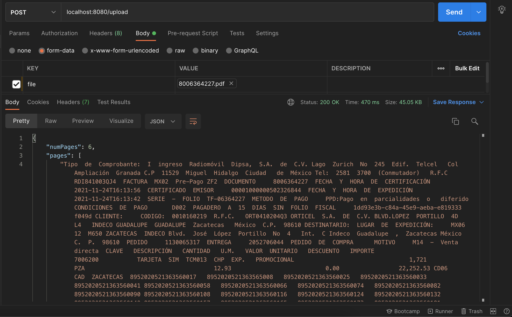

# ExpressJS server pdf to Json

## Description

This **API REST** is developed using **ExpressJS** to parse **pdf** files to **json**.

## Architecture

This **API REST** uses this technology:
* ExpressJS: to create API REST.
* NodeJS: to create API REST infrastructure with Express.
* pdfjs-dist: This is a pre-built version of the PDF.js source code. It is automatically generated by the build scripts.
* exceljs: Read, manipulate and write spreadsheet data and styles to XLSX and JSON.


.

## Install and run

Follow this steps to install and run this project:

1. Install [NodeJS](http://nodejs.org/) in your server.
2. Download this project.
3. Execute ``npm start`` command into project folder.
4. Now a webservice is running on port 8080 (by default).


## Usage: POST

You can access to all fields using next syntax:

* Parse: ``http://localhost:8080/pdf``

* Parse: ``http://localhost:8080/xml``

* HealthCheck: ``http://localhost:8080/``

## Docker 
### Build Image
```js
docker build -t pdf-xml-parse .
```


### Run image
```js
docker run --name pdf-xml-parse -p 8080:8080 -d pdf-xml-parse
```

## Demo



